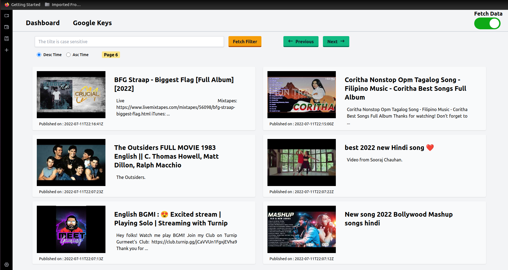
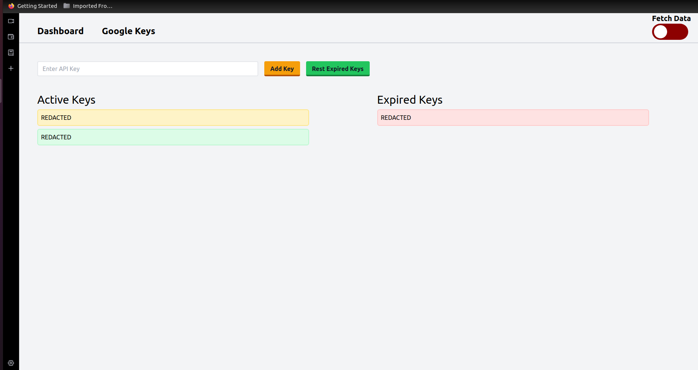

### Cloning the repository

Clone the repository using the command below :
```bash
https://github.com/KrishnanRGithub/youtube-api.git

```

Move into the directory where we have the project files : 
```bash
cd youPI

```

Create a virtual environment :
```bash
# Let's install virtualenv first
pip install virtualenv

# Then we create our virtual environment
virtualenv envname

```

Activate the virtual environment :
```bash
envname\scripts\activate

```

Install the requirements :
```bash
pip install -r requirements.txt

```

#

### Running the App

To run the App, we use :
```bash
python manage.py runserver

```

>  Then, the development server will be started at http://127.0.0.1:8000/

#


### Starting the Background Fetch

>  Ping to http://127.0.0.1:8000/api to start the background fetch or use the toggle in navbar

#


### Stopping the Background Fetch

>  Ping to http://127.0.0.1:8000/stop to stop the background fetch or use the toggle in navbar

#

### Screenshots


<table>
	<thead>
		<td>
			<b>Dashboard</b>
		</td>
		<td>
			<b>API Keys Page</b>
		</td>
	</thead>
	<tr>
		<td>
            
		</td>
		<td>
            
		</td>
	</tr>
</table>


#